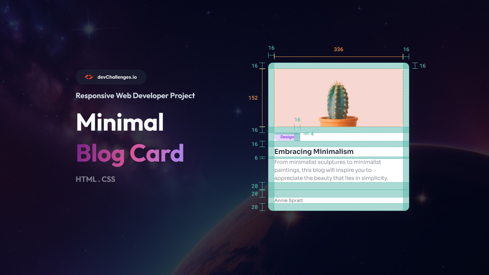
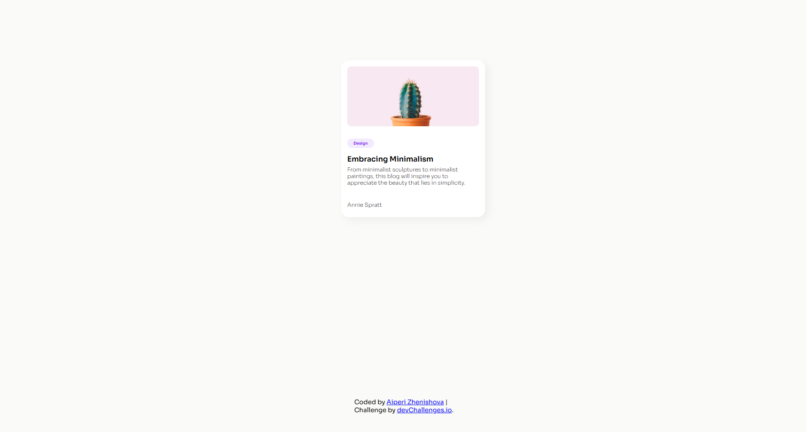

<!-- Please update value in the {}  -->

<h1 align="center">{Minimal blog card} | devChallenges</h1>

   Solution for a challenge <a href="https://devchallenges.io/challenge/minimal-blog-card" target="_blank">Minimal Blog Card</a> from <a href="http://devchallenges.io" target="_blank">devChallenges.io</a>.

  <h3>
    <a href="{ https://aiperizhenishova.github.io/Minimal-blog-card-starter-master/}">
      Demo
    </a>
     | 
    <a href="{https://github.com/aiperizhenishova/Minimal-blog-card-starter-master.git}">
      Solution
    </a>
     | 
    <a href="https://devchallenges.io/challenge/minimal-blog-card">
      Challenge
    </a>
  </h3>

<!-- TABLE OF CONTENTS -->

## Table of Contents

- [Overview](#overview)
  - [What I learned](#what-i-learned)
  - [Useful resources](#useful-resources)
- [Built with](#built-with)
- [Features](#features)
- [Contact](#contact)
- [Acknowledgements](#acknowledgements)

<!-- OVERVIEW -->

## Overview

<!--
Introduce your projects by taking a screenshot or a gif. Try to tell visitors a story about your project by answering:

- What have you learned/improved?
- Your wisdom? :)
-->

### What I learned / improved
- Practiced building a fully responsive web component using HTML and CSS.
- Learned to interpret a design mockup (JPG/Figma) and translate it into code.
- Improved skills in structuring reusable CSS classes and organizing content visually.

### Useful resources

- [CSS Tricks – A Complete Guide to Flexbox](https://css-tricks.com/snippets/css/a-guide-to-flexbox/) - Helped me understand layout and alignment for responsive design. I used some patterns here to structure my blog cards.
- [MDN Web Docs – CSS Grid](https://developer.mozilla.org/en-US/docs/Web/CSS/CSS_Grid_Layout) - This resource clarified grid layouts, which I applied when arranging cards and content sections.
- [Figma Design to Code Tips](https://www.figma.com/community/file/768809027345830741) - Helped me translate the mockup into actual HTML/CSS, especially for spacing and typography.

### Built with

<!-- This section should list any major frameworks that you built your project using. Here are a few examples.-->

- Semantic HTML5 markup
- CSS custom properties
- Flexbox
- CSS Grid
- [React](https://reactjs.org/)
- [Vue.js](https://vuejs.org/)
- [Tailwind](https://tailwindcss.com/)

## Features

<!-- List the features of your application or follow the template. Don't share the figma file here :) -->

This application/site was created as a submission to a [DevChallenges](https://devchallenges.io/challenges-dashboard) challenge.

## Acknowledgements

<!-- This section should list any articles or add-ons/plugins that helps you to complete the project. This is optional but it will help you in the future. For exmpale -->

## Author

- Website [Live Site](https://devchallenges.io/challenge/minimal-blog-card})
- GitHub [@aiperizhenishova](https://github.com/aiperizhenishova})
